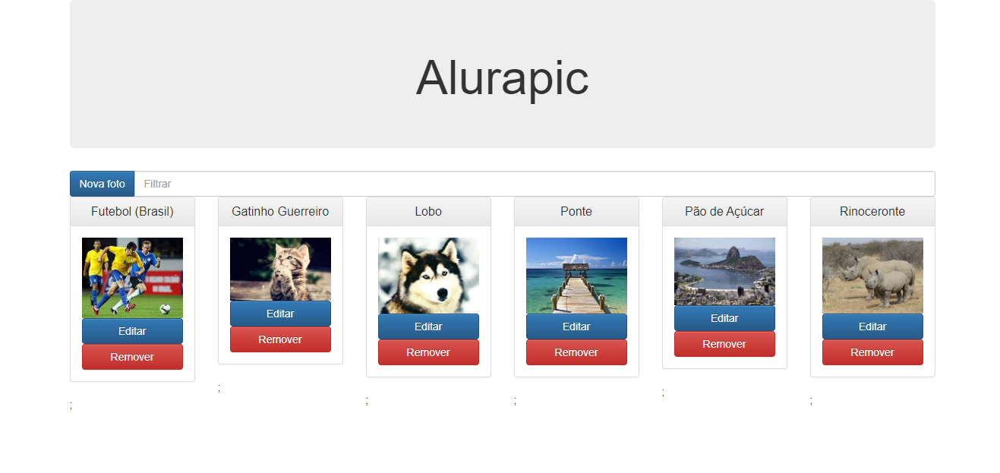

## Project Alurapic - Developed during  the course [AngularJS: crie webapps poderosas](https://www.alura.com.br/curso-online-angularjs-mvc)

<h1>
  
</h1>

### Technologies
- [AngularJS](https://angularjs.org/)
- [NodeJS](https://nodejs.org/en/)

### How to download

```bash
# Clone the repository
git clone https://github.com/GuilhermeFujita/Alurapic_AngularJS.git

# Enter the project directory
 cd Alurapic_AngularJS/alurapic/

 #Install dependencies
 npm install

 #Start the project (will use port 3000)
 npm start

#View project
Access web browser and type http://localhost:3000
```